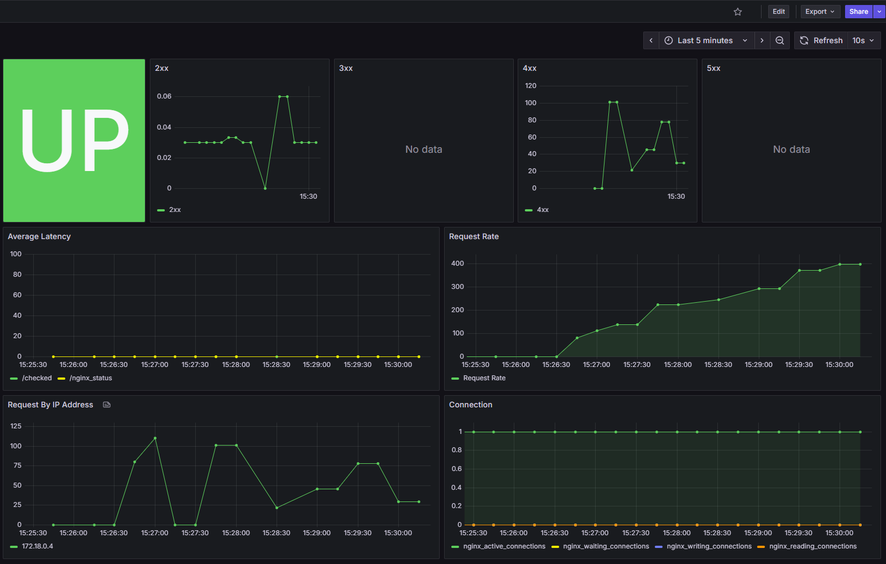

# Sysy - Nginx Access Log converter to Prometheus Metrics

## Background

I created this converter because I had difficulty using [one of the exporters](https://github.com/jkroepke/access-log-exporter). I know it's because of my skill issue and from what i see, it's more for k8s stack while mine is created for docker-compose stack. This repository was also inspired by that repository.I always encountered a parse error and not logged, even when I configured it the same way.

So, to have at least some informational metrics (since we know the official [nginx-prometheus-exporter](https://github.com/nginx/nginx-prometheus-exporter) doesn't provide anything important for the open-source version), I did something similar with the repository, which transfers syslog to this app and converts it into metrics, but with different variants of metrics and methodology.

## Usage

> [!NOTE]
> Every version that has release is safe to use. I'll update this repository later regarding an optimization or more metrics to be add.

### Image

```bash
docker pull daffaputranarendra/sysy:v0.0.2
```

### Nginx Configuration

Add Below Configuration to your existing nginx.conf. For example, check config directory in this repository.

```nginx
  log_format syslog_format '$remote_addr\t'
  '$request_method\t'
  '$status\t'
  '$request_completion\t'
  '$request_time\t'
  '$request_length\t'
  '$bytes_sent\t'
  '$request_uri';

  # Change <sysy-url> to the address of sysy app
  # (service name in docker or ip address)
  # and configured sysy port that run syslog server (default :5140)
  access_log syslog:server=<sysy-url>:<port>,nohostname syslog_format;
```

### Sysy Available Configuration

Configuration can be set using .env file if the code run from the source and via environment if using docker container. Here is the list available configuration:

- CONF_NGINX_TARGET_URL -> set nginx url target for stub_status (DEFAULT: http://nginx/nginx_status)
- CONF_SYSLOG_ADDR -> set syslog port number (DEFAULT: :5140)
- CONF_LOG_ENABLE -> to enable log mode in the app (DEFAULT: false)

For the example, you can see .env and docker-compose.yml in this repository. Please take a look that in the docker-compose.yml, the config in environment doesn't need "" (quote)!

### Grafana Dashboard

Import [JSON](./config/Nginx%20Monitoring-1755763182476.json) that is available in this repository.

<br/>


